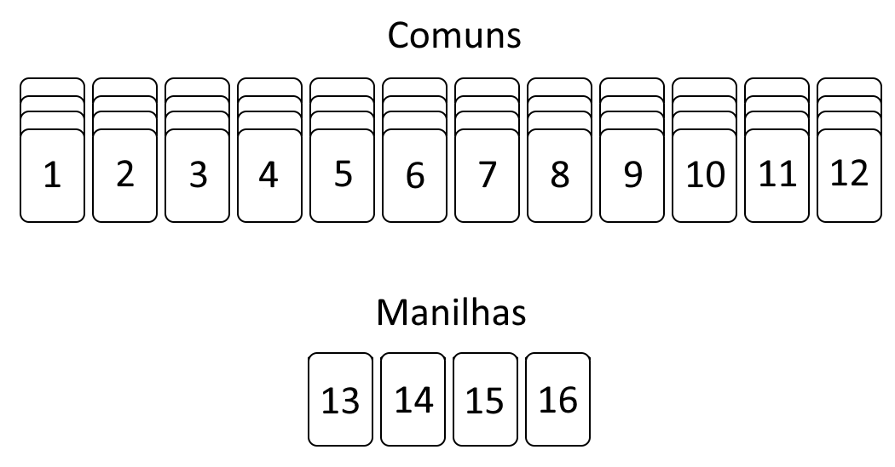

# Little fuck

Este repositório possui o código do jogo "Little Fuck", que está atualmente hospedado em \<COLOCAR LINK\>

## Sobre o jogo

Esta seção irá explicar as regras e funcionamento do jogo.

### Introdução

O "Little Fuck" é uma adaptação do jogo “Filho da puta” (também conhecido como "fodinha"), que originalmente é um jogo de baralho. As regras do jogo original podem ser acessadas em https://copag.com.br/blog/detalhes/fodinha.

O jogo pode ser jogado com 2 ou mais pessoas. Cada uma das pessoas iniciará com uma certa quantidade de vidas e ao decorrer do jogo, ao errar os palpites (será explicado mais adiante), os jogadores irão perdendo vidas. O jogo acaba quando resta apenas um participante com vida e todos os outros "mortos". Este jogador que não perdeu todas as suas vidas é o campeão, ficando na primeira posição. O último jogador a ser eliminado fica no segundo lugar, o penúltimo a ser eliminado em terceiro, e assim por diante.

### Cartas

Diferentemente do jogo original, as cartas não são iguais a de baralho, e sim, apenas um número, indicando a "força" da carta, sendo as de números mais altos mais fortes.

O jogo tem 52 cartas (igual ao baralho), sendo estas quatro cartas de números 1 a 12 (cartas comuns) e uma carta de números 13 a 16 (cartas manilhas). Uma ilustração das cartas do jogo pode ser vista logo abaixo:

É possível alterar as cartas do jogo a partir das configurações. Também existirão cartas especiais, como o coringa, que pode se passar por qualquer outra carta que estiver no jogo.

### Partidas

O jogo possui diversas partidas até que sobre apenas um jogador com vidas. No começo de cada partida, cartas aleatórias do baralho serão distribuídas aos jogadores. Na primeira partida, será distribuído apenas uma carta a cada um dos jogadores, na segunda partida, duas cartas, e assim por diante. Quando o número de cartas do baralho não for suficiente para entregar cartas para todos jogadores, voltará a ser distribuido apenas uma carta.

No começo de cada partida, os jogadores verão as suas próprias cartas recebidas e deverão fazer os seus palpites. O palpite consiste em dizer quantas rodadas você acredita ganhar com as cartas que está em mão. Por exemplo, se você estiver com cartas “altas” (como alguma manilha), palpitar alguma vitória pode ser uma boa ideia. Agora, se você está com cartas “fracas”, poderá não ganhar muitas rodadas. Dependendo da sua posição na fila de palpites, você terá informação dos palpites dos outros jogadores, o que pode te ajudar a fazer o seu próprio palpite.

A primeira partida de todas sorteia aleatoriamente um jogador que iniciará palpitando, e os próximos a palpitar seguirão uma ordem. Por exemplo, no jogo de baralho, pode ser o sentido horário, mas no jogo “Little Fuck” será a ordem de entrada no lobby. Então, se o terceiro jogador for sorteado a palpitar, o próximo na mesma partida será o quarto, depois o quinto, até o último que será o segundo jogador. Na próxima partida, o primeiro a palpitar será o quarto jogador, e na próxima partida será o quinto, e assim por diante (segue a mesma ordem de palpites). 

O último jogador a palpitar possui uma restrição: este não pode palpitar um número de rodadas que o somatório de todos palpites resulte no mesmo número de cartas. Por exemplo, considerando uma partida com 5 cartas, e que no momento do palpite do último jogador já foram palpitadas 4 vitórias, o último jogador não poderá palpitar apena uma vitória, ele poderá apenas palpitar 0 vitórias ou 2 ou mais vitórias (para que o somatório não dê 5 (4 + 1 = 5)).

Cada partida é composta por rodadas, definidas na próxima seção. Cada rodada pode ser vencida por apenas um jogador ou resultar em um empate (sendo uma rodada sem pontos). Os palpites são relacionados à vitórias dessas rodadas. Caso o palpite do jogador for correto, este não perderá nenhuma vida. Caso contrário, este perderá vidas, dependendo do tamanho do erro (por exemplo, se palpitar 5 e fazer apenas 2 rodadas, perde 3 vidas).

### Rodadas

Uma rodada consiste em todos os jogadores jogarem uma das suas cartas. Ao final da rodada, será verificado qual for a maior carta para definir um campeão daquela rodada. Podem acontecer empates, gerando assim uma rodada sem vencedores. Na primeira rodada de uma partida, o primeiro jogador a jogar é aquele que primeiro palpitou na partida. Após finalizar uma rodada, o primeiro a jogar a carta será aquele que acabou de ganhar a rodada. A mesma ordem de jogadas de cartas é mantida aqui, então, por exemplo, se o primeiro a jogar foi o jogador 3, o próximo será o 4, até o último que será o 2.

### Partida especial (apenas uma carta)

A partida com apenas uma carta é especial. Nessa partida, os jogadores não poderão ver as suas próprias cartas, mas poderão ver as cartas de todos os outros jogadores. Os palpites e a mesma mecânica se mantém, apenas essa visualização das cartas que é modificado nesse caso especial.

## Instalação e execução

Existem duas formas de executar o projeto, e cada uma com uma finalidade. Uma forma de execução é o modo produção, para colocar no ar o jogo para que o público possa jogar. A outra forma é desenvolvimento, para conseguir visualizar o resultado das modificações do código ao vivo.

### Como executar - Modo produção

Para subir o servidor, é preciso ter instalado o `Docker` e o `Docker Compose`. O docker disponibiliza um [tutorial para sua instalação](https://docs.docker.com/desktop/).

Com tudo instalado, para colocar o jogo no ar em modo de produção, siga os passos abaixo:

1 - Criar arquivo `.env`

As principais variáveis que devem ser modificadas são:

  - `SERVER_PATH`: endpoint para acessar o jogo. Para acessar a página, a URL final será: `<endereço_servidor>/<SERVER_PATH>`.
  - `PORT`: porta em que toda a aplicação ficará exposta.

2 - `docker-compose up`

Esse comando irá subir o servidor no ar (esse comando funciona para o Windows, mas pode ser diferente para outro OS). Isso pode levar um tempo considerável, já que irá instalar todas as bibliotecas necessárias. Mas, uma vez feito isso, é esperado que não seja mais tão demorado para executar novamente.

### Como executar - Modo desenvolvimento

Para instalar as bibliotecas, é neceessário ter o Node.js instalado. Pode ser instalado pelo [próprio site do Node.js](https://nodejs.org/en).

Com tudo instalado, para começar a desenvolver, siga os passos abaixo:

1 - Na pasta `backend`, executar comando `npm install`

Instalará as bibliotecas necessárias para subir o servidor do backend.

2 - Na mesma pasta, executar comando `npm run dev`

Este comando irá subir o servidor localmente, e sempre irá re-executar após alguma modificação dos arquivos do backend.
Deixar esse terminal aberto e não cancelar a execução, caso contrário, o servidor irá cair.
O servidor ficará exposto na porta 3000 (http://localhost:3000)

3- Na pasta `frontend`, agora em outro terminal, executar o comando `npm install`

Instalará as bibliotecas necessárias para subir o servidor do frontend.

4 - Na mesma pasta, executar comando `npm run dev`

Este comando irá subir o servidor localmente, e sempre irá re-executar após alguma modificação dos arquivos do frontend.
Deixar esse terminal aberto e não cancelar a execução, caso contrário, o servidor irá cair.
O servidor ficará exposto na porta 5173 (http://localhost:5173)
